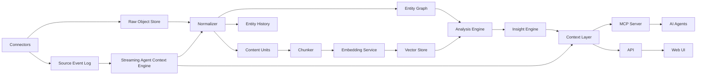

# System Architecture

## High-Level Architecture



## Runtime Components

### Web App

Responsibilities:

- authentication flow
- workspace and dataset management
- import setup
- entity mapper UI
- semantic map visualizations
- cluster/outlier/cohort dashboards
- insight and evidence explorer
- context-pack explorer
- report builder
- admin and connector settings

The web app is optional. MeaningGrid must also run in headless mode where MCP,
API, and CLI are the only interfaces.

Recommended stack:

- Next.js
- React
- TypeScript
- TanStack Query
- Tailwind or a restrained component system
- WebGL or Canvas for large maps
- D3/Plot/Observable Plot for charts

### API Service

Responsibilities:

- tenant and workspace API
- dataset and entity API
- connector configuration API
- analysis run API
- insight and evidence API
- authz checks
- context-pack API
- MCP-adjacent backend operations

Recommended stack:

- FastAPI for Python-first ML/analysis integration
- or NestJS if the team prefers TypeScript everywhere

Initial recommendation:

```text
FastAPI for API + workers + analysis library.
Next.js for frontend.
```

The analysis engine will be Python-heavy. Keeping API and workers in Python
will reduce early integration friction.

### Worker Service

Responsibilities:

- crawling
- connector syncs
- webhook processing
- stream event processing
- backfills
- file parsing
- content extraction
- entity normalization
- chunking
- embedding
- clustering
- report generation
- scheduled analyses
- reprocessing
- exports

Recommended options:

- MVP: Celery + Redis
- Enterprise/scale: Temporal

Use Celery first if speed matters. Use Temporal when workflows become long,
recoverable, and multi-step with human approvals.

### MCP Server

Responsibilities:

- expose workspace/dataset/entity resources
- expose semantic search and analysis tools
- expose context-pack builder
- expose reusable prompts
- enforce permissions
- redact sensitive content
- log agent access

The MCP server can be a separate process so enterprises can expose it inside
their private AI-agent environment without exposing the web app.

In headless deployments, the MCP server becomes the primary product surface.

### Streaming Agent Context Engine

Responsibilities:

- wrap incoming events in the canonical streaming envelope
- classify events into fast, batch, fast-and-batch, archive-only, or noise
- update hot context views for long-running agents
- build durable context units from entity/session windows
- publish context resource versions
- route context notifications to agent subscriptions
- collect routing feedback from agents
- preserve replayability through source events and raw objects

This component should not expose the internal event bus directly to agents.
Agents subscribe to MeaningGrid context resources through MCP/API and pull full
context only when needed.

### Agent Gateway

Optional enterprise component.

Responsibilities:

- map agent sessions to users or service accounts
- enforce tool allowlists
- apply rate limits
- route agents to the correct tenant/workspace
- correlate audit logs across agent conversations
- keep action tools disabled unless explicitly allowed

### Analysis Library

Responsibilities:

- vector math
- centroid metrics
- clustering
- outlier detection
- duplicate detection
- cohort comparison
- semantic drift
- gap detection
- UMAP/PaCMAP projection
- cluster labels
- insight feature generation

This should be a package with minimal dependency on web/API code.

### Connector Runtime

Responsibilities:

- connector definitions
- auth handling
- sync state
- rate limiting
- retries
- pagination
- source object capture
- incremental updates
- webhook handling
- event-stream handling
- backfill cursors
- idempotency keys
- source event creation

Connector code should not write directly to final tables. It should emit raw
source events, raw objects, and normalized proposals that the ingestion
pipeline validates.

## Deployment Modes

### Local Developer Mode

Goal:

```text
docker compose up
```

Components:

- web app
- API
- worker
- Postgres + pgvector
- Qdrant optional
- Redis
- MinIO optional
- local embedding model optional

### Headless Mode

Goal:

Run MeaningGrid as agent-facing infrastructure without the web dashboard.

Components:

- API
- worker
- MCP server
- Postgres
- vector store
- Redis/event bus
- object storage
- no web app

### Open-Source Standalone

Goal:

Run fully private on one server.

Components:

- Docker Compose
- Postgres + pgvector
- Qdrant
- Redis
- MinIO
- optional local LLM and embedding model

### Enterprise Standalone

Goal:

Run in customer environment with stronger controls.

Components:

- Kubernetes or OpenShift
- Helm chart
- Postgres operator or managed Postgres
- Qdrant cluster
- ClickHouse optional
- object storage
- SSO
- audit logging
- backup/restore
- network policies

### Managed SaaS

Goal:

Multi-tenant hosted service.

Components:

- Kubernetes or managed containers
- managed Postgres
- managed Qdrant or Qdrant cluster
- ClickHouse
- S3-compatible object storage
- managed queue or Redis
- observability stack
- SSO for enterprise tenants

## Service Boundary Recommendation

Start with a modular monolith:

```text
apps/api
apps/web
apps/worker
apps/mcp-server
packages/core
packages/connectors
packages/analysis
packages/context
```

Do not split into many network services too early. The first split should be
worker processes, not microservices.

## Data Flow

1. User creates workspace and dataset.
2. User configures connector or uploads files.
3. Connector creates source events and stores raw objects in object storage.
4. Streaming Agent Context Engine classifies events for fast/batch delivery.
5. Ingestion normalizes source events into entity changes.
6. Entity mapper confirms or auto-applies schema.
7. Current entity state and optional entity history are updated.
8. Content units and metric values are extracted.
9. Content is chunked.
10. Embeddings are generated.
11. Vectors are written to Qdrant or pgvector.
12. Context unit builders update live agent context from events and windows.
13. Analysis runs compute metrics, clusters, outliers, cohorts, and deltas.
14. Insight engine generates summaries and recommendations.
15. Context layer builds dataset cards, delta packs, and context packs.
16. Agent subscriptions receive relevant context notifications.
17. Humans use dashboards; agents use MCP/API.

## Internal Package Shape

```text
meaninggrid/
  apps/
    web/
    api/
    worker/
    mcp-server/
  packages/
    core/
    analysis/
    connectors/
    context/
    streaming-context/
    embeddings/
    vectorstores/
    reports/
    security/
  deployments/
    docker-compose/
    helm/
    terraform/
  examples/
    website-audit/
    company-benchmark/
    call-center/
    support-tickets/
  docs/
```
