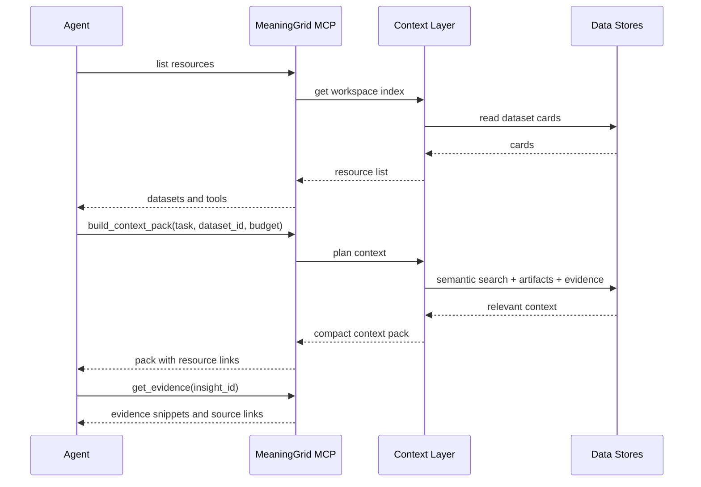

# Context Layer And MCP

## Purpose

The MeaningGrid Context Layer allows AI agents to progressively discover,
understand, query, and act on business data without loading entire datasets
into prompts.

It must work even when there is no MeaningGrid dashboard. In headless mode, the
context layer and MCP server are the main user interface.

This is more than RAG. It combines:

- dataset catalog
- entity schema
- entity graph
- semantic index
- metrics
- analysis summaries
- evidence packs
- permissions
- context budgets
- MCP resources, tools, and prompts

## Core Concept: Context Pack

A Context Pack is a compact, versioned, policy-aware bundle of information
prepared for a specific task.

Example tasks:

- "Compare successful and unsuccessful sales calls."
- "Explain why these branches underperform."
- "Prepare an executive report about this website."
- "Find pages that weaken topical authority."

Context pack contents:

```text
task intent
workspace summary
dataset card
entity schema
metric definitions
relevant entities
semantic clusters
cohort summaries
analysis artifacts
top evidence chunks
source citations
permissions
freshness timestamp
next discovery links
```

## Progressive Discovery Levels

Agents should not start with raw data. They should descend through context
levels as needed.

```text
L0: Workspace Index
    Datasets, entity types, available analyses, freshness.

L1: Dataset Card
    Source, schema, size, quality, import history, known metrics.

L2: Entity Type Card
    Entity definitions, relations, text fields, metrics.

L3: Semantic Map
    Centroids, clusters, outliers, duplicates, drift.

L4: Analysis Artifacts
    Cohort comparisons, success patterns, gap tables, reports.

L5: Evidence Pack
    Exact chunks, quotes, metric values, entities, citations.

L6: Raw Source
    Original HTML, transcript, ticket, spreadsheet row, API payload.
```

## Agent Interaction Pattern



## Streaming Agent Context Pattern

Long-running agents need more than request/response retrieval. MeaningGrid
should support a hybrid pattern:

```text
push notification -> agent decides -> pull full context resource
```

The notification tells the agent that a relevant context resource changed. The
agent then reads a context unit, entity profile, context pack, or evidence pack
through MCP. This keeps token usage and fan-out under control while still
allowing urgent events to reach agents quickly.

Examples:

- A Product Event agent is notified that a trial account now resembles
  accounts that usually upgrade.
- A Marketing agent is notified that a costly new search term has weak content
  coverage.
- A Support agent is notified that a ticket joins a churn-risk cluster.
- A VC agent is notified that a new startup matches a successful portfolio
  pattern.

Agents should never consume internal Kafka/Redpanda/NATS topics directly.
MeaningGrid owns routing, permissions, redaction, deduplication, and replay.

## MCP Server

The MCP server should expose:

- resources for context
- tools for discovery and analysis
- prompts for repeatable workflows

It should enforce:

- tenant isolation
- user permissions
- dataset policies
- PII redaction
- evidence access controls
- audit logging

Default mode should be read-only. Action tools must be explicitly enabled by
policy.

## Agent Sessions

Agent sessions should make headless access auditable and controllable.

Session fields:

- session_id
- tenant_id
- workspace_id
- actor_user_id
- agent_id
- client_name
- purpose
- allowed_tools
- policy_id
- started_at
- expires_at

Identity modes:

```text
user-delegated
service-account
workspace-agent
tenant-agent
anonymous-local
```

## MCP Resources

Stable resources:

```text
meaninggrid://workspaces
meaninggrid://workspace/{workspace_id}/overview
meaninggrid://dataset/{dataset_id}/card
meaninggrid://dataset/{dataset_id}/schema
meaninggrid://dataset/{dataset_id}/metrics
meaninggrid://dataset/{dataset_id}/streams
meaninggrid://dataset/{dataset_id}/recent-changes
meaninggrid://dataset/{dataset_id}/analysis-runs
meaninggrid://context-stream/{dataset_id}
meaninggrid://context-stream/{dataset_id}/subscription/{subscription_id}
meaninggrid://stream/{stream_id}/status
meaninggrid://entity-type/{entity_type_id}/card
meaninggrid://entity/{entity_id}/profile
meaninggrid://entity/{entity_id}/context-units
meaninggrid://cluster/{cluster_id}/summary
meaninggrid://analysis/{analysis_id}/summary
meaninggrid://insight/{insight_id}
meaninggrid://insight/{insight_id}/evidence
meaninggrid://context-unit/{context_unit_id}
meaninggrid://context-unit/{context_unit_id}/evidence
meaninggrid://context-pack/{context_pack_id}
meaninggrid://agent-subscription/{subscription_id}
meaninggrid://shared-memory/{memory_item_id}
meaninggrid://source/{raw_object_id}/raw
```

Resource templates:

```text
meaninggrid://dataset/{dataset_id}/entities?type={entity_type}
meaninggrid://dataset/{dataset_id}/clusters?level={entity|unit|chunk}
meaninggrid://dataset/{dataset_id}/outliers?entity_type={entity_type}
meaninggrid://dataset/{dataset_id}/similar-to/{entity_id}?limit={limit}
meaninggrid://dataset/{dataset_id}/semantic-search?query={query}
meaninggrid://analysis/{analysis_id}/artifact/{artifact_type}
meaninggrid://analysis/{analysis_id}/cohort/{cohort_id}
```

## MCP Tools

### Discovery Tools

```text
list_workspaces()
list_datasets(workspace_id)
list_streams(dataset_id)
get_stream_status(stream_id)
get_dataset_card(dataset_id)
get_schema(dataset_id)
list_entity_types(dataset_id)
get_entity_profile(entity_id)
```

### Search And Retrieval Tools

```text
search_context(query, filters, limit)
semantic_search(dataset_id, query, filters, limit)
find_similar_entities(entity_id, limit)
find_similar_chunks(content_chunk_id, limit)
get_evidence(insight_id, limit)
get_raw_source(raw_object_id)
```

Filters should use the canonical MeaningGrid filter grammar. The MCP server
must add permission and classification filters automatically based on the agent
session.

### Analysis Tools

```text
build_context_pack(task, dataset_id, budget_tokens, filters)
compare_entities(entity_ids, comparison_spec)
compare_cohorts(dataset_id, cohort_a, cohort_b, metric_ids)
find_outliers(dataset_id, entity_type, method)
explain_cluster(cluster_id)
explain_outlier(entity_id)
find_success_patterns(dataset_id, success_metric)
find_semantic_gaps(dataset_id, target_profile)
build_delta_context_pack(dataset_id, since, task, budget_tokens)
list_recent_changes(dataset_id, since)
subscribe_context(dataset_id, filters, semantic_interest, priority_min, delivery)
list_context_subscriptions(dataset_id)
list_changed_context(subscription_id, after_sequence, limit)
read_context_unit(context_unit_id)
ack_context_notification(notification_id, verdict)
resume_context_subscription(subscription_id, after_sequence)
routing_feedback(event_id, verdict, reason)
```

### Action Tools

These require stricter permissions.

```text
create_analysis_run(dataset_id, analysis_spec)
label_cluster(cluster_id, label)
save_agent_note(target_id, note)
save_shared_memory(target, content, scope, labels)
forget_shared_memory(memory_item_id, reason)
accept_insight(insight_id)
reject_insight(insight_id, reason)
create_report(dataset_id, report_spec)
export_artifact(artifact_id, format)
run_backfill(stream_id, date_range)
create_monitor(dataset_id, monitor_spec)
```

## MCP Prompts

Prompts should be reusable workflows surfaced to users and agents.

```text
/analyze_dataset
/build_context_pack
/compare_cohorts
/explain_outlier
/find_success_patterns
/prepare_executive_report
/audit_website_geo
/analyze_sales_calls
/analyze_support_tickets
/analyze_marketing_alignment
/summarize_recent_changes
/explain_cluster
/find_knowledge_gaps
```

## Context Pack JSON Shape

```json
{
  "id": "ctx_123",
  "task": "Compare successful and unsuccessful sales calls",
  "budget_tokens": 30000,
  "created_at": "2026-05-08T08:00:00Z",
  "freshness_at": "2026-05-07T23:10:00Z",
  "stream_watermarks": [
    {
      "stream": "Google Search Console",
      "watermark_at": "2026-05-07T00:00:00Z"
    }
  ],
  "analysis_window": {
    "from": "2026-04-08T00:00:00Z",
    "to": "2026-05-08T00:00:00Z",
    "mode": "incremental"
  },
  "workspace": {
    "id": "ws_1",
    "name": "ACME Sales"
  },
  "dataset": {
    "id": "ds_calls_q1",
    "name": "Q1 Calls",
    "entity_types": ["call", "agent", "customer", "transcript_turn"],
    "record_counts": {
      "call": 18240,
      "transcript_turn": 812900
    }
  },
  "metrics": [
    {
      "name": "sale_closed",
      "type": "boolean",
      "direction": "higher_is_better"
    }
  ],
  "semantic_findings": [
    {
      "title": "Pricing objection handling differs strongly",
      "confidence": 0.86,
      "evidence_resource": "meaninggrid://insight/ins_123/evidence"
    }
  ],
  "next_resources": [
    "meaninggrid://analysis/an_1/summary",
    "meaninggrid://insight/ins_123/evidence"
  ],
  "policy": {
    "pii_redacted": true,
    "allowed_actions": ["read", "analyze", "summarize"],
    "forbidden_actions": ["export_raw_pii", "modify_source_data"]
  }
}
```

## Context Budgeting

The context layer should support budgets:

```text
small: 8k tokens
medium: 32k tokens
large: 100k tokens
huge: 1M tokens
```

Budgeting strategy:

1. Always include dataset card and schema.
2. Include metric definitions relevant to the task.
3. Include summaries before examples.
4. Include diverse evidence, not only top-k nearest chunks.
5. Prefer source links over raw text when budget is tight.
6. Include next-resource links for progressive exploration.

## Evidence Rules

Every nontrivial claim returned to an agent should link to evidence:

- content chunks
- entities
- metric values
- raw source object
- analysis artifact
- confidence score

Imported content must be treated as untrusted evidence. It must not be allowed
to override system instructions, tool policies, or security rules.

## Agent Memory

MeaningGrid should support durable agent/user notes:

- cluster labels
- business assumptions
- accepted insights
- rejected insights
- report decisions
- entity annotations
- context improvements

Agent memory is not hidden chain-of-thought. It is explicit, inspectable, and
auditable project knowledge.

For shared agent infrastructure, use explicit shared memory items:

```text
private_agent
user_private
team_shared
workspace_shared
tenant_shared
module_shared
entity_scoped
```

Every durable memory item should include provenance, scope, confidence,
classification, access policy, validity interval, and expiry or supersession
metadata.

## Streaming Delivery Rules

MeaningGrid should use at-least-once delivery for context notifications.

Required fields in notifications:

- notification_id
- subscription_id
- resource_uri
- event_id
- sequence
- partition_key
- priority
- summary
- occurred_at
- watermark_at
- requires_pull

Agent clients should deduplicate by `notification_id` or `event_id`, then
acknowledge with a small verdict so routing can improve over time.

## Context Freshness

Every context response should include:

- dataset freshness
- stream watermarks
- analysis window
- recent changes since last context pack
- analysis run timestamp
- connector sync status
- embedding model version
- warning if stale

## Security Requirements

The context layer must be permission-aware:

- apply RBAC/ABAC before retrieval
- filter vector search results by tenant/workspace/dataset permissions
- redact PII when policy requires it
- audit all raw-source access
- restrict export tools
- distinguish read-only tools from write/action tools
