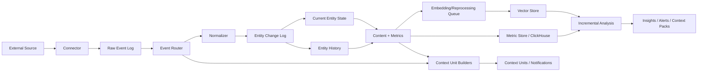

# Streaming And Incremental Data

## Why This Matters

MeaningGrid should not only import a static dataset and produce one report.

Many high-value use cases are continuous:

- Google Search Console impressions, clicks, queries, and pages
- Google Ads keywords, search terms, campaigns, costs, and conversions
- Meta/Facebook Ads campaigns, creatives, audiences, costs, and conversions
- ecommerce sales, product performance, margin, refunds, and inventory
- CRM deals and pipeline changes
- support tickets and live chats
- call transcripts as they arrive
- new companies or startups added to an investor portfolio
- new documents added to a knowledge base
- website pages changing over time

The platform must support:

```text
new data
changed data
deleted data
periodic sync
webhooks
event streams
backfills
reprocessing
historical comparison
```

## Core Principle

MeaningGrid should store source data with enough lineage to reprocess it later.

If we add a new metric, extractor, embedding model, chunking strategy, or
analysis type, the system should be able to run it over historical data without
requiring the customer to re-import everything.

```text
raw source event -> normalized entity changes -> derived content/metrics/vectors -> analysis
```

Derived data can be regenerated. Raw captured source data and change history
are the durable foundation.

## Data Flow



## Streaming Agent Context

MeaningGrid's streaming layer should also feed long-running AI agents.

Each source event should be routed into one or more paths:

```text
fast
batch
fast_and_batch
archive_only
drop_noise
manual_review
```

Fast path events update hot context views and may notify subscribed agents.
Batch path events are grouped into context units such as ticket timelines,
account journeys, campaign windows, startup dossiers, or audit evidence
windows. Both paths still preserve raw source lineage so the event can be
replayed and reprocessed later.

This is a delivery split, not a second processing codebase. The same canonical
event envelope, normalization logic, permission model, and derived artifact
tracking should apply to both paths.

## Ingestion Modes

### Batch Import

Examples:

- upload CSV
- import existing transcripts
- crawl website
- import historical tickets

Good for:

- initial dataset creation
- one-time analysis
- backfills

### Periodic Sync

Examples:

- pull Google Search Console daily
- pull Google Ads hourly
- pull ecommerce sales every 15 minutes
- crawl changed website pages weekly

Good for:

- APIs without reliable webhooks
- marketing data
- analytics data
- daily dashboards

### Webhooks

Examples:

- ticket created
- deal stage changed
- new order
- new chat
- new transcript

Good for:

- near-real-time updates
- event-driven systems

### Event Streaming

Examples:

- Kafka topic
- Redpanda topic
- NATS stream
- AWS Kinesis
- Google Pub/Sub
- Azure Event Hubs

Good for:

- high-volume events
- enterprise internal streams
- real-time pipelines

### Change Data Capture

Examples:

- Debezium from Postgres/MySQL
- database replication logs
- warehouse incremental tables

Good for:

- customer databases
- ecommerce events
- internal business systems

## Stream Object Model

Add these concepts to the data model.

### data_streams

Represents a continuous data source.

Fields:

- id
- tenant_id
- workspace_id
- dataset_id
- source_id
- stream_type
- name
- status
- sync_mode
- cursor_json
- watermark_at
- schedule_cron
- created_at
- updated_at

stream_type examples:

```text
google_search_console
google_ads
meta_ads
ecommerce_orders
crm_deals
support_tickets
call_transcripts
webhook
kafka
cdc_postgres
custom_api
```

sync_mode examples:

```text
batch
periodic
webhook
stream
cdc
```

### source_events

Append-only event log of incoming source changes.

Fields:

- id
- tenant_id
- workspace_id
- dataset_id
- source_id
- data_stream_id
- external_event_id
- event_type
- occurred_at
- received_at
- source_updated_at
- raw_object_id
- idempotency_key
- payload_hash
- processing_status
- partition_key
- sequence
- priority_hint
- route_hint
- metadata_json

event_type examples:

```text
created
updated
deleted
metric_observed
snapshot_observed
relationship_changed
content_changed
```

### event_routes

Routing decisions produced by the Streaming Agent Context Engine.

Fields:

- id
- tenant_id
- workspace_id
- dataset_id
- source_event_id
- route
- priority
- urgency_score
- confidence
- reason
- rule_id
- classifier_version
- memory_scope
- ttl_seconds
- decided_at

### context_units

Aggregated, agent-readable context produced from source events.

Examples:

- campaign daily alignment
- trial account journey
- support ticket timeline
- customer session rollup
- startup dossier
- contract obligation timeline

Fields:

- id
- tenant_id
- workspace_id
- dataset_id
- context_unit_type
- entity_id
- title
- summary
- facts_json
- metrics_json
- source_event_ids_json
- valid_from
- valid_to
- watermark_at
- version_number
- confidence

### agent_subscriptions

Subscriptions define which agents should be notified about changed context.

Fields:

- id
- tenant_id
- workspace_id
- dataset_id
- agent_session_id
- filters_json
- semantic_interest
- priority_min
- delivery_mode
- last_sequence
- status

### context_notifications

Durable notifications sent to agents.

Fields:

- id
- agent_subscription_id
- context_unit_id
- source_event_id
- resource_uri
- sequence
- partition_key
- priority
- status
- delivered_at
- acknowledged_at
- verdict

### entity_change_events

Normalized changes derived from source events.

Fields:

- id
- tenant_id
- workspace_id
- dataset_id
- source_event_id
- entity_id
- entity_type_id
- change_type
- valid_from
- valid_to
- properties_patch_json
- content_changed
- metrics_changed
- relations_changed
- created_at

change_type examples:

```text
upsert
delete
restore
metric_update
relation_update
content_update
```

### entity_versions

Historical entity state when versioning is enabled.

Fields:

- id
- tenant_id
- workspace_id
- dataset_id
- entity_id
- version_number
- valid_from
- valid_to
- content_hash
- properties_json
- source_event_id
- created_at

### derived_artifacts

Tracks derived outputs that can be invalidated and regenerated.

Fields:

- id
- tenant_id
- workspace_id
- dataset_id
- artifact_kind
- target_type
- target_id
- derivation_spec_id
- input_hash
- output_hash
- status
- created_at
- invalidated_at

artifact_kind examples:

```text
content_chunk
embedding
metric_value
cluster_assignment
summary
context_card
insight
report_section
```

### derivation_specs

Versioned definitions of how derived data is computed.

Fields:

- id
- tenant_id
- workspace_id
- name
- spec_type
- version
- config_json
- code_version
- created_at

spec_type examples:

```text
chunking_strategy
embedding_model
metric_extractor
entity_mapper
clusterer
sentiment_model
topic_classifier
summary_prompt
analysis_template
```

## Idempotency

Streaming systems will send duplicate events. MeaningGrid must handle this.

Every event should have an idempotency key:

```text
source_id + external_event_id
```

Fallback:

```text
source_id + event_type + external_object_id + source_updated_at + payload_hash
```

If the same event arrives twice, the second ingest should be a no-op.

## Current State And History

MeaningGrid needs both:

```text
current state: fast dashboards and current context
history: temporal analysis, reprocessing, auditability
```

Current state tables:

- entities
- content_units
- content_chunks
- metric_values latest view
- relations
- embeddings current collection

Historical tables/logs:

- source_events
- entity_change_events
- entity_versions
- metric time series
- raw_objects
- analysis_runs

## Time-Aware Metrics

Marketing and business analysis needs time windows.

Metric values should support:

- observed_at
- valid_from
- valid_to
- aggregation_window
- dimensions

Examples:

```text
query impressions by day
keyword cost by hour
campaign conversions by day
product sales by day
page clicks by day
startup valuation at investment date
```

Metric dimensions:

```text
country
device
campaign
ad_group
keyword
query
page
product
channel
source
```

ClickHouse should become important here because marketing and sales metrics can
grow quickly.

## Marketing Project Example

Entities:

```text
website
page
paragraph
keyword
search_query
campaign
ad_group
ad
product
order
customer_segment
```

Streams:

```text
Google Search Console daily query/page metrics
Google Ads hourly campaign/ad group/keyword/search term metrics
Meta Ads campaign/ad/adset/creative metrics
Ecommerce orders and product sales
Website crawl snapshots
```

Questions:

- Do paid keywords semantically match landing page content?
- Are expensive search terms covered by strong website content?
- Which organic queries have no paid campaign support?
- Which high-converting products lack content clusters?
- Which pages receive traffic for queries they do not semantically satisfy?
- Does linkbuilding target pages that align with profitable campaigns?
- Which new keywords are semantically far from existing content?

Analysis:

```text
keyword -> nearest pages
search query -> nearest content clusters
campaign -> landing page semantic alignment
ad copy -> page content similarity
product sales -> content coverage
paid cost -> organic content gap
link target -> revenue/traffic relevance
```

Example insight:

```text
Google Ads search terms around "enterprise invoice approval workflow" have
high spend and good conversion, but the nearest website content is generic
accounts-payable material. No page sits close to the paid-query centroid.
Create or update a landing page around invoice approval workflows and link it
from the accounting automation cluster.
```

## Investor Portfolio Example

Entities:

```text
startup
founder
market
pitch_deck
memo
financial_metric
investment_decision
portfolio_company
rejected_company
```

Streams:

```text
new startup application
new pitch deck
updated financials
new investor memo
new market note
portfolio performance update
```

Questions:

- Is this new startup similar to successful portfolio companies?
- Is it similar to rejected companies?
- Which portfolio cluster does it belong to?
- What risks are common in nearest failed/rejected startups?
- What success patterns exist in similar invested startups?
- Is the company semantically novel but financially promising?

Analysis:

```text
new startup -> nearest invested startups
new startup -> nearest rejected startups
new startup -> market cluster
new startup -> founder/background similarity
new startup -> memo risk themes
new startup -> performance analogs
```

Example insight:

```text
The new startup is semantically closest to three previously rejected companies
in the SMB payroll compliance cluster, mostly because of similar go-to-market
language and weak differentiation. However, its revenue growth resembles two
successful portfolio companies. The key due-diligence question is whether its
distribution advantage is real or only pitch language.
```

## Reprocessing

Reprocessing is a first-class capability.

Reasons:

- new metric extractor
- new embedding model
- improved chunking strategy
- new analysis template
- new PII redaction policy
- new cluster labeling method
- customer asks a new question about old data

Reprocessing workflow:

1. User or system creates derivation spec.
2. System identifies affected raw objects/entities/chunks.
3. System creates reprocessing job.
4. Derived artifacts are created with new spec version.
5. Old derived artifacts are preserved or marked superseded.
6. Analysis runs can compare old vs new outputs.

Do not overwrite historical analysis by default.

## Backfills

Backfills import historical data into a stream.

Examples:

- last 16 months of Google Search Console data
- last 2 years of Google Ads cost data
- all historical ecommerce orders
- all previously rejected startups

Backfill requirements:

- date range
- rate limits
- checkpointing
- resumability
- progress reporting
- deduplication
- partial failure handling

## Incremental Analysis

Not every new event should trigger a full analysis.

Use invalidation scopes:

```text
content changed -> re-chunk, re-embed, update nearest neighbors
metric changed -> recompute cohort/metric summaries
relation changed -> recompute graph metrics
new entity -> assign cluster, update centroid approximation
many changes -> schedule full analysis
```

Analysis modes:

```text
incremental
windowed
full_refresh
backfill
comparison
```

Window examples:

```text
last 24 hours
last 7 days
last 30 days
current month
campaign period
investment cohort
```

## Alerts And Monitors

Streaming data enables monitoring.

Alert examples:

- new paid keyword is far from all website content
- campaign spend increased but semantic landing-page match is low
- new startup is highly similar to refused companies
- support ticket cluster is growing quickly
- new page is a topical outlier
- successful-call pattern disappeared this week
- sentiment cluster worsened after product release

Alert definition:

```text
trigger condition
dataset scope
entity filters
metric window
semantic threshold
delivery channel
severity
cooldown
```

## Secure Storage

For streaming sources, secure storage matters even more.

Requirements:

- raw events encrypted at rest
- connector credentials in secret manager
- source payload retention policy
- per-stream access policies
- raw source access audit
- redaction before context-pack exposure
- delete stream and all derived vectors/artifacts

## Event Processing Guarantees

Initial guarantee:

```text
at-least-once processing with idempotent writes
```

This is realistic and sufficient for most connectors.

For agent notifications, use:

```text
at-least-once delivery with agent-side deduplication
```

MeaningGrid should preserve ordering only per `partition_key`, not globally.
Agent subscriptions should support replay from the last acknowledged sequence
inside a configured replay window.

Later:

- ordered processing per external object
- exactly-once-like behavior through idempotency and transactional outbox
- dead-letter queues
- replay from source_events
- backpressure for slow agent consumers
- consumer groups for agent replicas
- watermarks for complete context windows

## Infrastructure Options

Local/community:

```text
Redis queue
Postgres
Qdrant or pgvector
MinIO
scheduled workers
```

Enterprise streaming:

```text
Kafka or Redpanda
NATS JetStream
AWS Kinesis / SQS
Google Pub/Sub
Azure Event Hubs / Service Bus
```

Use an EventBus interface:

```text
publish(topic, event)
subscribe(topic, handler)
ack(event)
retry(event)
dead_letter(event)
```

## Product UI

Streaming UI should include:

- streams list
- sync status
- latest watermark
- event volume
- error rate
- backfill progress
- changed entities
- invalidated analyses
- reprocessing jobs
- monitors and alerts
- data freshness on every dashboard

## MCP Context For Streaming Data

Agents should see freshness and temporal scope.

Context pack should include:

```text
dataset freshness
stream watermarks
analysis window
metric time window
whether results are incremental or full refresh
changed entities since last pack
recommended reprocessing if stale
```

MCP tools to add:

```text
list_streams(dataset_id)
get_stream_status(stream_id)
list_recent_changes(dataset_id, since)
build_delta_context_pack(dataset_id, since, task)
subscribe_context(dataset_id, filters, semantic_interest, priority_min, delivery)
list_changed_context(subscription_id, after_sequence, limit)
ack_context_notification(notification_id, verdict)
read_context_unit(context_unit_id)
run_backfill(stream_id, date_range)
create_monitor(dataset_id, monitor_spec)
list_alerts(dataset_id)
```

## Implementation Phases

### Phase A: Periodic Sync Foundation

- data_streams table
- source_events table
- idempotency
- sync jobs
- watermarks
- recent changes API

### Phase B: Reprocessing Foundation

- derivation_specs table
- derived_artifacts table
- artifact invalidation
- reprocessing jobs
- backfill jobs

### Phase C: Marketing Streams

- Google Search Console connector
- Google Ads connector
- ecommerce orders JSONL/webhook connector
- keyword/page semantic alignment analysis

### Phase D: Streaming Infrastructure

- EventBus interface
- Redis implementation
- Kafka/Redpanda implementation
- dead-letter queues
- stream monitoring UI

### Phase E: Monitors And Alerts

- monitor definitions
- scheduled evaluation
- semantic thresholds
- alert history
- email/Slack/webhook delivery

### Phase F: Agent Context Subscriptions

- event_routes table
- context_units table
- agent_subscriptions table
- context_notifications table
- notify-then-pull MCP resources
- ack and resume
- routing feedback
