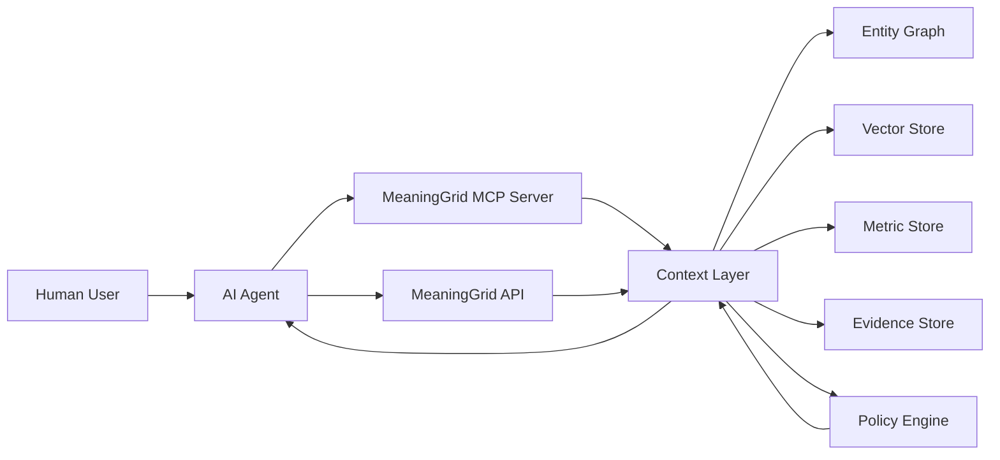

# Headless Agent Infrastructure

## Purpose

MeaningGrid should work without a human-facing dashboard.

In headless mode, the platform is an infrastructure layer that gives AI agents
safe, progressive, evidence-backed access to business data. The user interacts
with the data through an AI agent in Claude, Codex, Cursor, an internal copilot,
Slack, Teams, or a custom chat interface.

The web UI becomes optional:

```text
Human asks agent -> Agent uses MeaningGrid MCP/API -> MeaningGrid returns context,
analysis, evidence, and actions -> Agent explains to human
```

## Product Statement

Headless MeaningGrid:

> A governed semantic context and analysis backend for AI agents.

Enterprise version:

> Deploy a private MeaningGrid control plane so your AI agents can understand,
> compare, monitor, and explain business data without exposing raw systems
> directly.

## Headless Architecture



## Headless Components

### MCP Server

Primary interface for interactive AI agents.

Responsibilities:

- resource discovery
- dataset cards
- entity profiles
- semantic search
- context-pack generation
- delta context-pack generation
- evidence retrieval
- analysis execution
- read-only and action tool separation
- permission enforcement
- audit logging

### REST API

Primary interface for automation, backend services, and custom copilots.

Responsibilities:

- workspace and dataset management
- connector and stream configuration
- import and sync jobs
- analysis run creation
- context-pack creation
- report/export generation
- admin operations

### CLI

Primary interface for local developers and automation scripts.

Responsibilities:

- bootstrap local instance
- import data
- run syncs
- run analysis
- start MCP server
- inspect jobs
- export artifacts

### Agent Gateway

Optional enterprise component that sits between agents and MeaningGrid.

Responsibilities:

- agent identity mapping
- session management
- tenant/workspace routing
- tool allowlists
- rate limiting
- policy enforcement
- audit correlation
- secrets isolation

This can be a separate service later. For MVP, the MCP server and API can
perform these responsibilities directly.

## Headless Deployment Modes

### Local Agent Backend

```text
docker compose up
meaninggrid mcp start
```

Used by:

- developers
- local research
- secure laptops
- small teams

### Private Agent Context Server

```text
MeaningGrid runs inside company network.
Claude/Codex/internal agents connect to MCP endpoint.
```

Used by:

- AI teams
- internal copilots
- secure enterprise environments

### Embedded Infrastructure

MeaningGrid is embedded behind another product.

Used by:

- SaaS vendors
- agencies
- vertical AI products
- consulting platforms

The external product owns the UI. MeaningGrid provides ingestion, entity
modeling, analysis, context packs, and MCP/API.

### Managed Headless Cloud

MeaningGrid is hosted by us, but customers use their own agent interface.

Used by:

- companies that want managed infrastructure
- teams that already standardize on Claude/OpenAI/Codex/Cursor
- agencies serving many clients

## Agent Session Model

Agent sessions should be explicit.

Fields:

- session_id
- tenant_id
- workspace_id
- actor_user_id
- agent_id
- client_name
- purpose
- started_at
- expires_at
- allowed_tools
- policy_id
- metadata_json

Session benefits:

- auditable conversations
- scoped tool access
- context-pack reuse
- rate limits
- user permission inheritance
- evidence traceability

## Agent Identity

MeaningGrid needs to know who the agent represents.

Identity modes:

```text
user-delegated
service-account
workspace-agent
tenant-agent
anonymous-local
```

Recommended defaults:

- local mode: anonymous-local or local admin
- SaaS: user-delegated
- enterprise automation: service-account
- internal copilots: user-delegated with SSO identity

## Agent Capabilities

Agents should be able to:

- discover datasets
- understand schema
- search semantically
- retrieve evidence
- compare entities
- compare cohorts
- inspect recent changes
- run analyses
- build context packs
- subscribe to context changes
- acknowledge context notifications
- create monitors
- generate reports
- save labels or notes

Capabilities should be grouped:

```text
read_context
read_evidence
run_analysis
manage_streams
write_annotations
subscribe_context
export_data
admin
```

## Read-Only By Default

Headless infrastructure must be safe.

Default MCP mode:

```text
read-only
```

Read-only allows:

- list resources
- read dataset cards
- semantic search
- get evidence
- build context packs
- inspect analysis artifacts

Action mode must be explicitly enabled.

Action mode can allow:

- create analysis run
- start sync
- run backfill
- create monitor
- save note
- label cluster
- create report
- export artifact

Admin mode should be separate from action mode.

## Context Contracts

Agents need predictable context objects, not ad hoc prose.

MeaningGrid should define stable contracts:

```text
DatasetCard
EntityTypeCard
EntityProfile
MetricCard
ClusterSummary
Insight
EvidencePack
ContextPack
DeltaContextPack
AnalysisArtifact
StreamStatus
RecentChanges
ContextUnit
ContextStream
ContextNotification
SharedMemoryItem
```

Each contract should include:

- id
- type
- human-readable summary
- machine-readable fields
- freshness
- source links
- policy/redaction state
- next resources

## Long-Running Agent Subscriptions

Headless deployments should support resident agents that watch for important
context changes.

Pattern:

```text
agent creates subscription -> MeaningGrid routes events -> agent receives small notification -> agent pulls context unit
```

Subscription examples:

- watch active trials likely to upgrade or fail
- watch paid keywords with weak content match
- watch high-value support tickets entering risk clusters
- watch new startups matching portfolio success patterns
- watch compliance evidence becoming stale

Subscription controls:

- filters
- semantic interest
- priority threshold
- context budget
- replay window
- pause/resume
- expiry
- allowed actions after notification

This keeps MeaningGrid useful as pure infrastructure: the customer's chosen AI
agent can be the entire interface.

## Agent-Friendly Responses

Responses should be:

- structured
- concise by default
- expandable through resources
- citation/evidence aware
- freshness aware
- permission aware
- stable across versions

Bad response:

```text
Here are 50,000 records.
```

Good response:

```text
Here is the dataset card, three relevant clusters, two cohort differences,
ten evidence snippets, and links to deeper resources.
```

## Progressive Discovery For Headless Use

Default agent flow:

1. List workspaces and datasets.
2. Read dataset card.
3. Read schema and metrics.
4. Build task-specific context pack.
5. Ask targeted semantic searches.
6. Retrieve evidence.
7. Run or inspect analysis.
8. Produce answer with citations.
9. Save useful notes or labels if permitted.

## Headless Marketing Example

Human asks:

```text
Are our new paid keywords aligned with website content this week?
```

Agent flow:

1. `list_datasets()`
2. `get_dataset_card(marketing_dataset)`
3. `list_streams(marketing_dataset)`
4. `build_delta_context_pack(since=last_week, task=keyword alignment)`
5. `semantic_search("high cost keywords with weak landing page match")`
6. `get_evidence(insight_id)`
7. Explain:
   - mismatched keywords
   - affected campaigns
   - spend/conversion impact
   - nearest pages
   - content recommendations
   - evidence links

## Headless Investor Example

Human asks:

```text
This new startup applied today. Is it similar to companies we invested in or
rejected?
```

Agent flow:

1. `list_recent_changes(portfolio_dataset, since=today)`
2. `get_entity_profile(new_startup)`
3. `find_similar_entities(new_startup, filters=invested)`
4. `find_similar_entities(new_startup, filters=rejected)`
5. `compare_entities([new_startup, nearest_analogs])`
6. `build_context_pack(task=investment memo)`
7. Explain:
   - nearest invested analogs
   - nearest rejected analogs
   - shared patterns
   - risk themes
   - metric differences
   - diligence questions

## Observability For Headless Mode

Headless systems need strong observability because there may be no UI user
watching jobs.

Track:

- MCP tool calls
- API calls
- agent sessions
- context packs created
- evidence resources accessed
- raw source accesses
- analysis runs
- sync/backfill jobs
- failed tool calls
- denied permission attempts
- token and model usage

## Headless Configuration

Configuration should support:

```text
MEANINGGRID_MODE=headless
MEANINGGRID_ENABLE_WEB=false
MEANINGGRID_ENABLE_MCP=true
MEANINGGRID_MCP_READONLY_DEFAULT=true
MEANINGGRID_REQUIRE_AGENT_SESSIONS=true
MEANINGGRID_CONTEXT_MAX_TOKENS=30000
```

Docker Compose profiles:

```text
default
headless
full
enterprise
```

Headless profile:

- API
- worker
- MCP server
- Postgres
- vector store
- Redis/event bus
- object storage
- no web app

## Security Requirements

Headless mode must not bypass security.

Requirements:

- authenticated MCP sessions
- user or service-account identity
- RBAC/ABAC checks
- read-only default
- per-tool authorization
- redaction policies
- raw source access audit
- rate limits
- export restrictions
- prompt-injection defense
- tool-call logging

## Product Implications

The dashboard is useful, but not required.

MeaningGrid has three product surfaces:

```text
Human dashboard: visual exploration and admin
Agent interface: MCP resources, tools, prompts
Infrastructure API: automation and embedded products
```

For open source, headless mode helps developers quickly attach MeaningGrid to
their preferred agents.

For enterprise, headless mode is the strongest infrastructure story: companies
can add governed semantic context to agents without forcing employees to adopt
another dashboard.
