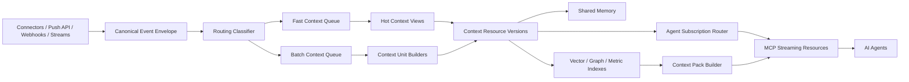

# Streaming Agent Context Engine

## Purpose

MeaningGrid should include a Streaming Agent Context Engine: a live context
fabric that sits between incoming business events and AI agents.

The goal is to let agents understand what is happening across datasets without
polling every source, reading raw event streams, or loading huge histories into
their context window.

This layer is inspired by the open-source context-engine proposal in
`yasha-dev1/masters-streaming-ai-agent-architecture`, but adapted to
MeaningGrid's broader semantic intelligence platform. MeaningGrid should not
copy a narrow Slack/JIRA/ecommerce agent engine. It should generalize the same
principles across websites, marketing data, VC deal flow, product events,
support, sales, legal, HR, procurement, compliance, and custom datasets.

## Core Idea

Every incoming event should move through one unified pipeline:

```text
source event
  -> canonical event envelope
  -> route/classify
  -> normalize entities and metrics
  -> update hot context views
  -> update durable context units and shared memory
  -> notify subscribed agents when useful
  -> expose context through MCP/API
```

Fast and batch are delivery semantics, not two separate systems.

The same event can:

- update current entity state
- update embeddings and search indexes
- update time-series metrics
- update context units
- trigger an immediate agent notification
- be stored for replay and reprocessing

## Architecture



## What To Adopt From The Referenced Project

### 1. Streaming-First, Kappa-Style Design

MeaningGrid should prefer one streaming-first job graph with multiple outputs
over classical Lambda architecture with separate batch and speed code paths.

Practical interpretation:

- Recent events flow through Redis, Redpanda, Kafka, NATS, or a similar bus.
- Raw event payloads are durably stored in object storage and Postgres records.
- The same normalization and context-building logic can replay historical data.
- Fast delivery and batch aggregation are branches of one pipeline.
- Long-horizon replay reads from object storage or warehouse tables rather than
  depending only on long broker retention.

This maps well to MeaningGrid's existing reprocessing requirement: raw events
remain the foundation, while vectors, summaries, metrics, insights, and context
packs are derived and can be regenerated.

### 2. Fast Path And Batch Path Routing

Every source event should receive a routing decision.

Routing actions:

```text
fast
batch
fast_and_batch
archive_only
drop_noise
manual_review
```

Fast path:

- urgent, user-visible, or agent-actionable events
- low-latency updates to hot context views
- immediate notification to matching agent subscriptions

Batch path:

- non-urgent events
- session/entity windows
- rollups, summaries, context units, and shared memory updates
- delivery when a context unit is complete enough to be useful

Archive-only:

- source events retained for lineage and future reprocessing
- no immediate semantic processing unless requested later

Drop-noise:

- safe only when source policy allows it
- should retain a minimal rejection/audit record

### 3. Layered Event Classification

Routing should use a cascade so MeaningGrid does not call expensive models on
every event.

Recommended classifier stages:

1. Envelope normalization.
2. Declarative rules.
3. Metadata and metric scoring.
4. Small local classifier for ambiguous events.
5. Optional LLM audit or offline labeling.
6. Agent feedback loop.

The classifier output should be explainable:

```json
{
  "route": "fast_and_batch",
  "priority": "p1",
  "reason": "trial_account_high_fit_but_activation_stalled",
  "confidence": 0.87,
  "classifier_version": "trial-router-2026-05-08",
  "ttl_seconds": 3600,
  "memory_scope": "workspace_shared"
}
```

This lets customers audit why an event reached an agent.

### 4. Entity-Centric Context Units

Batch aggregation should not emit raw event dumps. It should emit context units:
small, typed, versioned, semantically meaningful records that agents can read.

Examples:

```text
support_ticket_timeline
sales_deal_timeline
trial_account_journey
customer_session_rollup
campaign_daily_alignment
keyword_content_gap_rollup
startup_dossier
portfolio_similarity_update
contract_obligation_timeline
vendor_risk_update
audit_evidence_window
knowledge_topic_update
```

A context unit should include:

- title
- summary
- structured facts
- relevant entities
- metrics and windows
- source event references
- raw object references
- vector/search text
- graph relations
- validity interval
- watermark
- confidence
- policy and classification labels
- version

Example:

```json
{
  "context_unit_type": "trial_account_journey",
  "entity_id": "acct_123",
  "title": "InvoiceFlow trial account activation journey",
  "summary": "The account invited 4 users and connected Stripe but has not created an approval workflow.",
  "facts": [
    {"key": "users_invited", "value": 4},
    {"key": "integration_connected", "value": "stripe"},
    {"key": "activation_missing", "value": "workflow_created"}
  ],
  "metrics": {
    "upgrade_score": 0.61,
    "nearest_converter_similarity": 0.82
  },
  "valid_from": "2026-05-08T08:00:00Z",
  "valid_to": "2026-05-08T10:00:00Z",
  "watermark_at": "2026-05-08T10:02:00Z",
  "source_event_ids": ["evt_1", "evt_2", "evt_3"],
  "next_resources": [
    "meaninggrid://entity/acct_123/profile",
    "meaninggrid://context-unit/cu_123/evidence"
  ]
}
```

## Canonical Event Envelope

MeaningGrid already has a push envelope. For streaming agent context, it should
be extended with CloudEvents-compatible fields while preserving MeaningGrid
labels, classification, ACLs, and source lineage.

Recommended envelope:

```json
{
  "specversion": "1.0",
  "id": "evt_01J...",
  "source": "meaninggrid://source/google_ads/src_123",
  "type": "marketing.search_term.observed",
  "subject": "keyword:kw_123",
  "time": "2026-05-08T09:15:00Z",
  "datacontenttype": "application/json",
  "dataschema": "meaninggrid://schema/marketing.search_term.observed/v1",
  "partitionkey": "dataset:ds_123:keyword:kw_123",
  "sequence": "18422",
  "traceparent": "00-...",
  "tenant_id": "t_1",
  "workspace_id": "ws_1",
  "dataset_id": "ds_1",
  "source_id": "src_123",
  "stream_id": "str_123",
  "idempotency_key": "src_123:search_term_456:2026-05-08T09:15:00Z",
  "priority_hint": "normal",
  "route_hint": "batch",
  "labels": {
    "module": "marketing",
    "channel": "paid_search",
    "country": "SK"
  },
  "classification": {
    "level": "internal",
    "pii": false
  },
  "acl": {
    "groups": ["marketing"]
  },
  "data": {}
}
```

Important fields:

- `id` plus `source` form a deduplication key.
- `partitionkey` preserves per-entity ordering.
- `sequence` supports resume and gap detection.
- `subject` names the logical entity or object affected.
- `labels`, `classification`, and `acl` drive filtering and permissions.
- `route_hint` is producer input, not a final decision.

## Routing Classifier

The routing classifier should produce a durable `event_route` record.

Route fields:

- source_event_id
- route
- priority
- urgency_score
- confidence
- reason
- rule_id
- classifier_name
- classifier_version
- feature_snapshot_json
- memory_scope
- ttl_seconds
- decided_at
- feedback_status

Priority examples:

```text
p0: interrupt-class, immediate agent attention
p1: high priority, deliver before normal updates
p2: normal stream update
p3: low priority, batch only
```

Fast path examples:

- Product Event: a high-fit trial account becomes stuck before activation.
- Marketing: an expensive new paid search term has no strong matching page.
- Support: a ticket from a high-value customer joins a known churn-risk cluster.
- Sales: an enterprise deal changes stage after a competitor objection.
- VC: a new startup matches a successful portfolio pattern unusually well.
- Legal: a high-risk contract clause appears in a new vendor agreement.
- Compliance: audit evidence becomes stale before a control deadline.

Batch path examples:

- daily keyword/content alignment updates
- support issue cluster rollups
- weekly sales objection summaries
- portfolio similarity refresh
- monthly vendor risk summaries
- knowledge-base topic drift updates

## Agent Subscriptions

Agents should not subscribe to internal broker topics. They should subscribe to
MeaningGrid context resources through MCP/API.

Subscription dimensions:

- tenant/workspace/dataset
- module
- entity types
- entity IDs or partition keys
- labels and classifications
- metric thresholds
- semantic interest
- priority threshold
- delivery mode
- context budget

Example:

```json
{
  "name": "Marketing agent high-cost gap watcher",
  "dataset_id": "ds_marketing",
  "filters": {
    "and": [
      {"eq": {"field": "labels.module", "value": "marketing"}},
      {"eq": {"field": "entity_type", "value": "search_term"}},
      {"gte": {"field": "metrics.cost", "value": 100}},
      {"lt": {"field": "analysis.best_page_alignment", "value": 0.72}}
    ]
  },
  "semantic_interest": "paid keywords that are not well supported by website content",
  "priority_min": "p1",
  "delivery": "notify_then_pull",
  "context_budget_tokens": 8000
}
```

Delivery modes:

```text
notify_then_pull
inline_small_event
daily_digest
context_unit_only
manual_poll_only
```

Default should be `notify_then_pull`: the notification is small, and the agent
pulls the full context unit or context pack when it is ready.

## MCP Streaming Resources

MeaningGrid should expose a small MCP-compatible streaming profile.

Resources:

```text
meaninggrid://context-stream/{dataset_id}
meaninggrid://context-stream/{dataset_id}/subscription/{subscription_id}
meaninggrid://context-unit/{context_unit_id}
meaninggrid://context-unit/{context_unit_id}/evidence
meaninggrid://entity/{entity_id}/context-units
meaninggrid://agent-subscription/{subscription_id}
meaninggrid://shared-memory/{memory_item_id}
```

Tools:

```text
subscribe_context(dataset_id, filters, semantic_interest, priority_min, delivery)
list_context_subscriptions(dataset_id)
list_changed_context(subscription_id, after_sequence, limit)
read_context_unit(context_unit_id)
ack_context_notification(notification_id, verdict)
resume_context_subscription(subscription_id, after_sequence)
routing_feedback(event_id, verdict, reason)
save_shared_memory(target, content, scope, labels)
forget_shared_memory(memory_item_id, reason)
```

Notification shape:

```json
{
  "notification_id": "ntf_123",
  "subscription_id": "sub_123",
  "resource_uri": "meaninggrid://context-unit/cu_123",
  "event_id": "evt_123",
  "sequence": "18422",
  "partitionkey": "dataset:ds_1:account:acct_123",
  "priority": "p1",
  "reason": "trial_upgrade_score_changed",
  "summary": "Trial account ACME is now similar to converters but has not completed activation.",
  "occurred_at": "2026-05-08T09:15:00Z",
  "watermark_at": "2026-05-08T09:16:00Z",
  "requires_pull": true
}
```

Agents should be able to:

1. Subscribe once.
2. Receive lightweight change notifications.
3. Pull full context only when needed.
4. Acknowledge and give routing feedback.
5. Resume after reconnect using sequence numbers.

## Delivery Semantics

Initial guarantee:

```text
at-least-once delivery with idempotent consumers
```

MeaningGrid should not promise exactly-once delivery into an AI agent. The
practical guarantee is:

- duplicate notifications may happen
- every notification has a stable ID
- every source event has a stable idempotency key
- agents should deduplicate by `event_id` or `notification_id`
- ordering is guaranteed only per partition key
- replay is available within a configured retention window

Required mechanics:

- sequence per subscription/resource
- partition key per event
- durable notification log
- ack status
- replay window
- gap detection
- dead-letter handling
- subscription pause/resume
- priority queueing

Later enterprise mechanics:

- backpressure credits
- consumer groups for multiple agent replicas
- watermarks for completeness
- long-lived auth refresh
- per-agent rate limits
- tenant-level notification budgets

## Shared Memory

The batch path should write to governed shared memory, not hidden agent memory.

Memory item types:

```text
observation
summary
fact
decision
assumption
accepted_insight
rejected_insight
agent_note
human_feedback
playbook
policy
```

Memory scopes:

```text
private_agent
user_private
team_shared
workspace_shared
tenant_shared
module_shared
entity_scoped
```

Shared memory item fields:

- id
- tenant_id
- workspace_id
- dataset_id
- scope
- target_type
- target_id
- memory_type
- title
- content
- facts_json
- source_event_ids
- context_unit_ids
- created_by_actor
- created_by_agent_session_id
- confidence
- labels_json
- classification_json
- access_policy_id
- valid_from
- valid_to
- expires_at
- supersedes_memory_item_id
- created_at

Rules:

- Memory must be inspectable and auditable.
- Source provenance is mandatory for durable factual memory.
- Human-approved memories can be marked protected.
- Agents can propose memories; policy decides whether they become shared.
- Memory can expire, be superseded, or be forgotten by policy.
- Memory is not chain-of-thought and should not store hidden reasoning.

## Hot Context Views

The fast path needs hot read models for low-latency agent and API access.

Examples:

- current trial account state
- current ticket escalation state
- current campaign spend/alignment state
- current deal risk state
- current startup intake state
- current contract review risk

Implementation options:

- Postgres materialized/current-state tables for MVP.
- Redis for very hot or ephemeral state.
- ClickHouse materialized views for high-volume event metrics.
- Qdrant/pgvector for newest embedded context units.
- Graph table or graph DB for relationships and temporal facts.

Hot views are projections. Durable truth remains the raw event log plus
normalized entity and metric history.

## How This Connects To MeaningGrid Core

### Data Model

The layer extends existing objects:

- `source_events`: canonical event envelope and raw lineage.
- `entity_change_events`: normalized changes.
- `metric_values`: time-series facts.
- `derived_artifacts`: generated embeddings, summaries, and context units.
- `context_packs`: task-specific bundles.
- `agent_sessions`: authenticated consumers.

New concepts:

- `event_routes`
- `context_units`
- `context_resource_versions`
- `agent_subscriptions`
- `context_notifications`
- `shared_memory_items`
- `routing_feedback`

### Analysis Engine

The engine supplies:

- similarity scoring
- nearest analogs
- cohort comparison
- outlier detection
- drift detection
- semantic gap detection
- event sequence scoring
- success pattern extraction

The Streaming Agent Context Engine decides when those outputs are fresh or
important enough to become live context for agents.

### Modules

Modules define:

- source event types
- routing rules
- context unit types
- subscription templates
- context pack templates
- shared memory types
- MCP prompts
- monitors

For example, Product Event Intelligence defines a `trial_account_journey`
context unit and a `trial_upgrade_risk` subscription template. Marketing
Intelligence defines a `campaign_alignment_window` context unit and a
`paid_keyword_content_gap` subscription template.

## Module Examples

### Marketing Intelligence

Fast path:

- high-spend search term appears with weak page alignment
- campaign cost spikes while conversion falls
- competitor term starts converting

Batch path:

- daily query/page alignment rollup
- campaign-to-content gap context unit
- monthly topic authority drift summary

Agent use:

- recommend which content to create or update
- detect budget waste
- connect paid demand to organic content gaps
- explain why a keyword cluster is underperforming

### VC Fund Intelligence

Fast path:

- new startup matches a successful portfolio cluster
- new startup strongly resembles rejected companies with known risks
- portfolio company KPI update indicates drift from success pattern

Batch path:

- startup dossier
- founder/market similarity rollup
- portfolio cluster refresh

Agent use:

- prepare investment context
- surface hidden analogs
- suggest diligence questions
- monitor portfolio risk pattern changes

### Product Event Intelligence

Fast path:

- trial account reaches a high conversion-likelihood state
- high-fit account stalls before activation
- usage sequence matches churn/non-upgrade patterns

Batch path:

- account journey context unit
- activation funnel pattern rollup
- weekly converter/non-converter cohort comparison

Agent use:

- recommend sales/customer-success actions
- identify missing onboarding steps
- personalize outreach
- detect product activation friction

### Customer Support Intelligence

Fast path:

- high-value customer ticket matches churn-risk cluster
- new issue cluster accelerates
- sentiment sharply worsens in a thread

Batch path:

- ticket timeline
- issue cluster summary
- weekly support pattern memory

Agent use:

- draft escalation briefs
- suggest troubleshooting paths
- find similar solved tickets
- identify product defects behind ticket volume

## Evaluation

MeaningGrid should measure this layer separately from normal search quality.

Metrics:

- latency from event received to notification
- latency from event received to context unit available
- notification precision
- missed urgent event rate
- duplicate notification rate
- agent feedback verdict distribution
- replay correctness
- gap detection correctness
- context unit token density
- context unit factual faithfulness
- answer quality with and without context subscriptions
- cost per 1,000 events
- storage growth per stream

Agent feedback vocabulary:

```text
appropriate
too_urgent
too_slow
irrelevant
missing_context
wrong_recipient
useful_but_low_priority
```

This feedback can train routing rules and classifiers over time.

## Implementation Phases

### Phase 1: Context Event Envelope

- extend canonical push envelope with streaming fields
- add partition keys, sequence, route hints, priority hints
- store all fields in `source_events`
- add filter support for streaming fields

### Phase 2: Event Routing MVP

- implement deterministic route rules
- add `event_routes`
- support route outputs: fast, batch, fast_and_batch, archive_only
- expose route reason and confidence
- add dead-letter path

### Phase 3: Context Units

- add `context_units`
- build first context unit builders:
  - product trial account journey
  - marketing keyword/content gap rollup
  - support ticket timeline
- embed context units
- expose context unit resources over API/MCP

### Phase 4: Agent Subscriptions

- add `agent_subscriptions`
- add `context_notifications`
- support notify-then-pull over MCP/API
- support ack and resume
- add notification audit logs

### Phase 5: Shared Memory

- add `shared_memory_items`
- allow agents to propose memory
- allow policies to approve, scope, expire, or reject memory
- connect context units and insights to shared memory

### Phase 6: Learned Routing

- collect routing feedback
- add classifier feature snapshots
- train small source/module-specific classifiers
- use LLMs offline for labeling and audit
- monitor drift and false-positive/false-negative costs

### Phase 7: Enterprise Streaming Semantics

- backpressure
- consumer groups
- replay windows by subscription
- watermarks
- priority queues
- long-lived auth refresh
- Kafka/Redpanda/NATS adapters
- ClickHouse materialized analytics views

## Design Decisions

Initial decisions:

- Use Postgres as the durable metadata and source-of-truth database.
- Use object storage for raw payload retention.
- Use Qdrant or pgvector for semantic retrieval.
- Use ClickHouse for high-volume metric/event analytics when needed.
- Use Redis queue first; add Redpanda/Kafka/NATS behind an EventBus interface.
- Use notify-then-pull as the default agent delivery pattern.
- Treat shared memory as explicit governed data, not hidden prompt state.
- Promise at-least-once delivery and idempotency, not exactly-once agent action.

Open questions:

- Should context units be stored as `derived_artifacts`, a first-class table, or
  both?
- Should semantic subscriptions be evaluated in the routing classifier or as a
  second-stage filter after route classification?
- How much of MCP Streaming Resources should MeaningGrid implement before the
  official ecosystem stabilizes?
- Which module should be the first live-agent demo: Marketing, Product Events,
  or Support?
- Should enterprise deployments support graph DBs early, or model the temporal
  graph in Postgres first?

## Sources Reviewed

- GitHub proposal:
  <https://github.com/yasha-dev1/masters-streaming-ai-agent-architecture/blob/main/proposal.md>
- Streaming architecture research:
  <https://github.com/yasha-dev1/masters-streaming-ai-agent-architecture/blob/main/research/RQ1-lambda-vs-kappa.md>
- Event classification research:
  <https://github.com/yasha-dev1/masters-streaming-ai-agent-architecture/blob/main/research/RQ2-event-classification.md>
- Batch aggregation research:
  <https://github.com/yasha-dev1/masters-streaming-ai-agent-architecture/blob/main/research/RQ3-batch-aggregation.md>
- Context distribution research:
  <https://github.com/yasha-dev1/masters-streaming-ai-agent-architecture/blob/main/research/RQ4-context-distribution.md>
- Shared memory research:
  <https://github.com/yasha-dev1/masters-streaming-ai-agent-architecture/blob/main/research/RQ5-shared-memory.md>
- Push protocol synthesis:
  <https://github.com/yasha-dev1/masters-streaming-ai-agent-architecture/blob/main/research/push-protocol/report.md>
