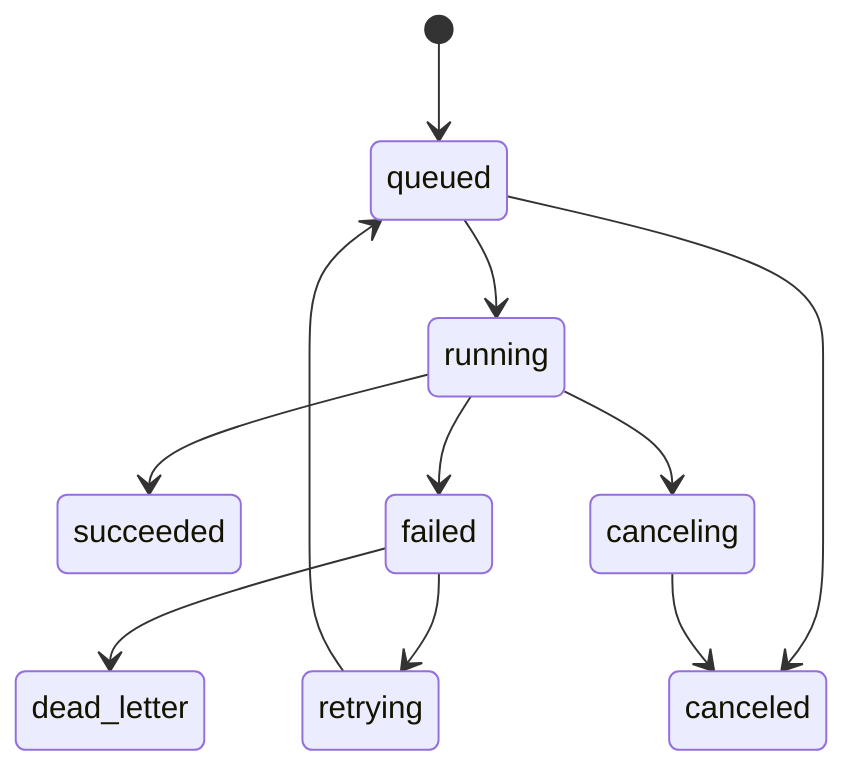

# Worker Jobs And State Machines

## Purpose

MeaningGrid v0 uses background jobs for all long-running work:

- crawling
- extraction
- embedding
- analysis
- report generation

The API and UI should never block on these workflows.

## Queue Choice

V0:

```text
Celery + Redis
```

Later:

```text
Temporal
```

The job table should be independent of Celery so MeaningGrid can switch
workflow engines later.

## Job Statuses

```text
queued
scheduled
running
waiting
succeeded
failed
canceling
canceled
retrying
dead_letter
```

V0 can implement only:

```text
queued
running
succeeded
failed
canceled
```

But the status field should allow later states.

## State Machine



## Job Types V0

### run_site_audit_v0

Orchestration job.

Child jobs:

```text
crawl_site
extract_site_content
embed_dataset
analyze_site_technical
analyze_site_semantic
analyze_site_geo
build_site_report
```

### crawl_site

Inputs:

```json
{
  "dataset_id": "ds_...",
  "source_id": "src_...",
  "base_url": "https://example.com",
  "max_pages": 100,
  "respect_robots": true,
  "render_javascript": false
}
```

Outputs:

```json
{
  "pages_discovered": 120,
  "pages_fetched": 87,
  "pages_failed": 4,
  "raw_object_ids": []
}
```

### extract_site_content

Inputs:

```json
{
  "dataset_id": "ds_...",
  "source_id": "src_...",
  "crawl_job_id": "job_..."
}
```

Outputs:

```json
{
  "pages_created": 87,
  "content_units_created": 640,
  "links_created": 920,
  "metric_values_created": 1100
}
```

### embed_dataset

Inputs:

```json
{
  "dataset_id": "ds_...",
  "target": "content_chunks",
  "embedding_model": "default_local"
}
```

Outputs:

```json
{
  "chunks_seen": 640,
  "chunks_embedded": 620,
  "chunks_skipped": 20,
  "vector_collection": "mg_default_content"
}
```

### analyze_site_technical

Creates technical issue artifacts and insights.

### analyze_site_semantic

Creates clusters, duplicates, outliers, internal link opportunities, and
projection artifacts.

### analyze_site_geo

Creates GEO readiness metrics, artifacts, and insights.

### build_site_report

Creates HTML report artifact.

## Progress Reporting

Every job should update:

```text
progress_current
progress_total
progress_message
```

Examples:

```text
Discovering sitemap
Fetching page 12 of 100
Extracting paragraphs
Embedding chunks 240 of 640
Computing clusters
Generating insights
```

Write detailed progress to `job_events`.

## Idempotency

Jobs should be safe to retry.

Rules:

- crawl uses URL and content hash to avoid duplicate raw objects
- source events use idempotency keys
- entities use dataset/entity_type/external_id uniqueness
- content units use entity/unit_kind/order/content_hash uniqueness
- embeddings use content_hash and embedding model
- analysis runs can create new artifacts rather than overwrite old ones

## Error Handling

Each job failure should include:

```text
error_code
error_message
job_event with traceback reference if available
```

Do not store huge tracebacks directly in the main job row. Store detailed logs
in job events or object storage later.

Common error codes:

```text
invalid_url
robots_blocked
fetch_timeout
unsupported_content_type
html_parse_failed
embedding_provider_failed
vector_store_failed
analysis_failed
database_error
```

## Retry Policy

Default:

```text
max_attempts: 3
backoff: exponential
```

Do not retry:

- invalid URL
- robots blocked
- validation errors
- unsupported content type

Retry:

- fetch timeout
- transient network error
- embedding provider rate limit
- vector store temporary failure
- database deadlock

## Cancellation

V0 cancellation can be best effort.

API sets status:

```text
canceling
```

Worker checks between units of work:

- before fetching next URL
- before embedding next batch
- before starting next analysis step

Then sets:

```text
canceled
```

## Job Event Types

```text
created
started
progress
warning
child_job_created
retry_scheduled
failed
succeeded
canceled
```

Example:

```json
{
  "event_type": "progress",
  "message": "Fetched page",
  "data": {
    "url": "https://example.com/pricing",
    "status_code": 200
  }
}
```

## Worker Queues

V0 queues:

```text
default
crawl
embedding
analysis
reports
```

Suggested routing:

```text
crawl_site -> crawl
extract_site_content -> default
embed_dataset -> embedding
analyze_* -> analysis
build_site_report -> reports
```

## Concurrency

Local defaults:

```text
crawl concurrency: 4 URLs
embedding batch size: 32 chunks
worker concurrency: 2
```

Config via environment:

```text
WORKER_CONCURRENCY=2
CRAWLER_CONCURRENCY=4
EMBEDDING_BATCH_SIZE=32
```

## Orchestration

V0 orchestration can be simple:

```text
run_site_audit_v0 job calls child service functions in sequence
```

But every phase should still write job state so it can be split into true child
jobs later.

Better v0.2:

```text
parent job creates child jobs and waits/polls
```

Later:

```text
Temporal workflow
```

## UI Job Behavior

The UI should poll:

```text
GET /jobs/{job_id}
GET /jobs/{job_id}/events
```

Poll interval:

```text
1-2 seconds while running
5-10 seconds for long jobs
```

UI should show:

- current phase
- progress
- warnings
- failures
- link to partial results when available

## Acceptance Tests

- queued job becomes running then succeeded
- failed job records error_code and error_message
- retryable failure increments attempt_count
- duplicate crawl retry does not duplicate entities
- cancellation sets canceled
- job events are written in order
- UI can poll job status
